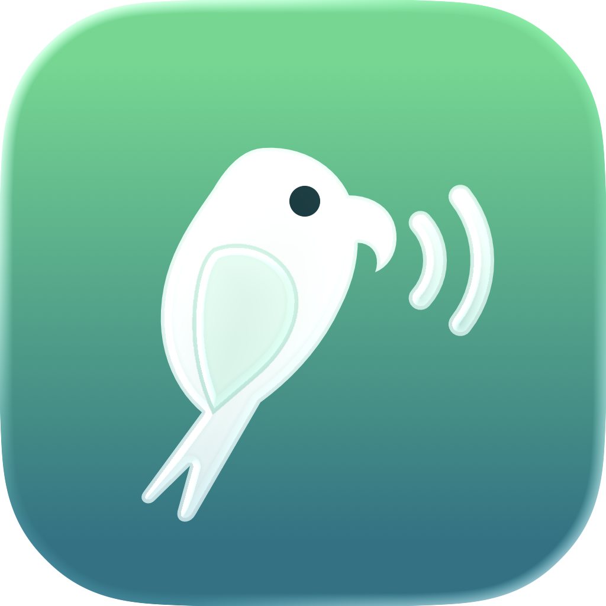
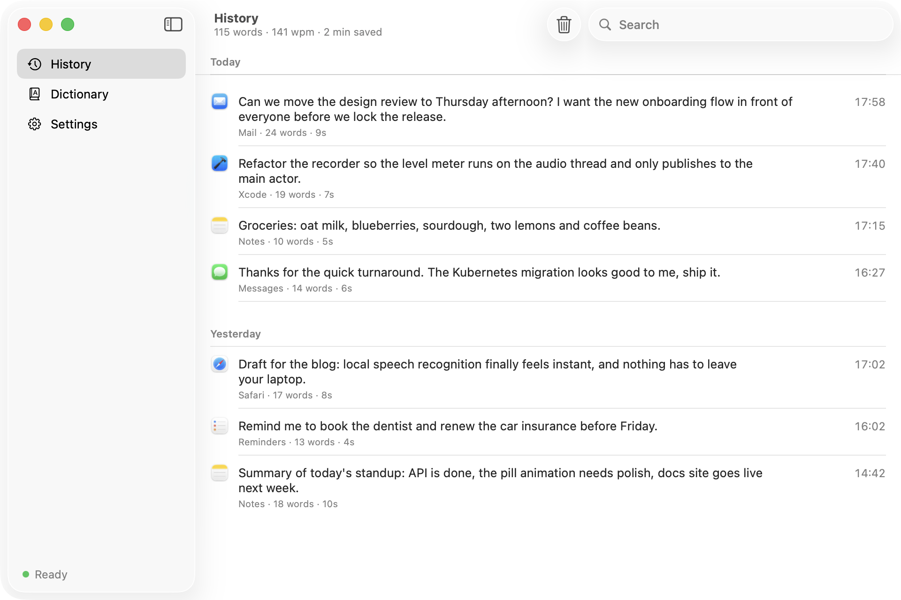
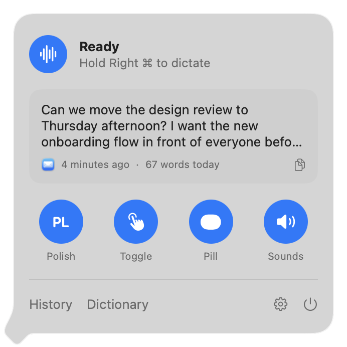
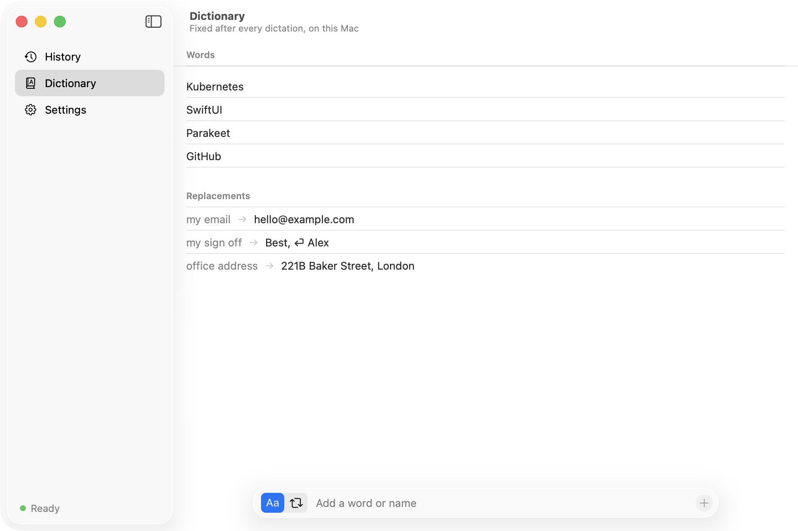
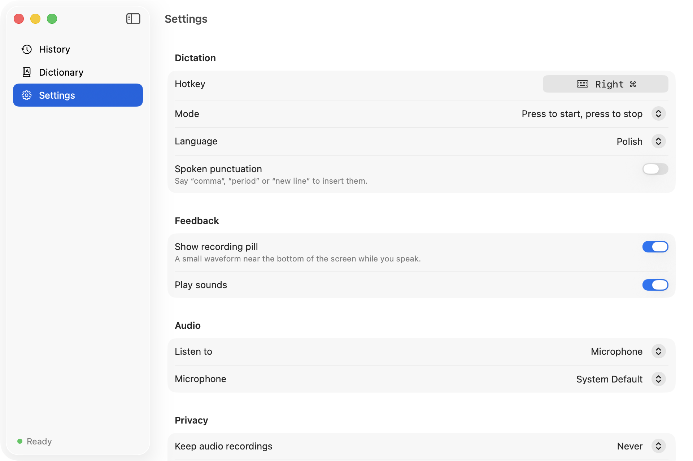
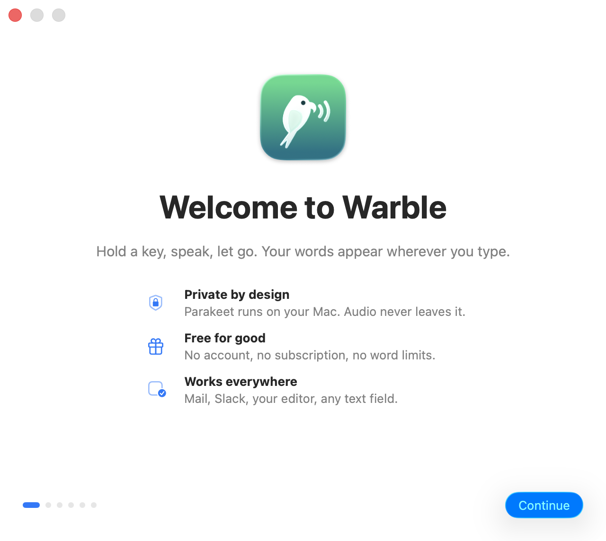
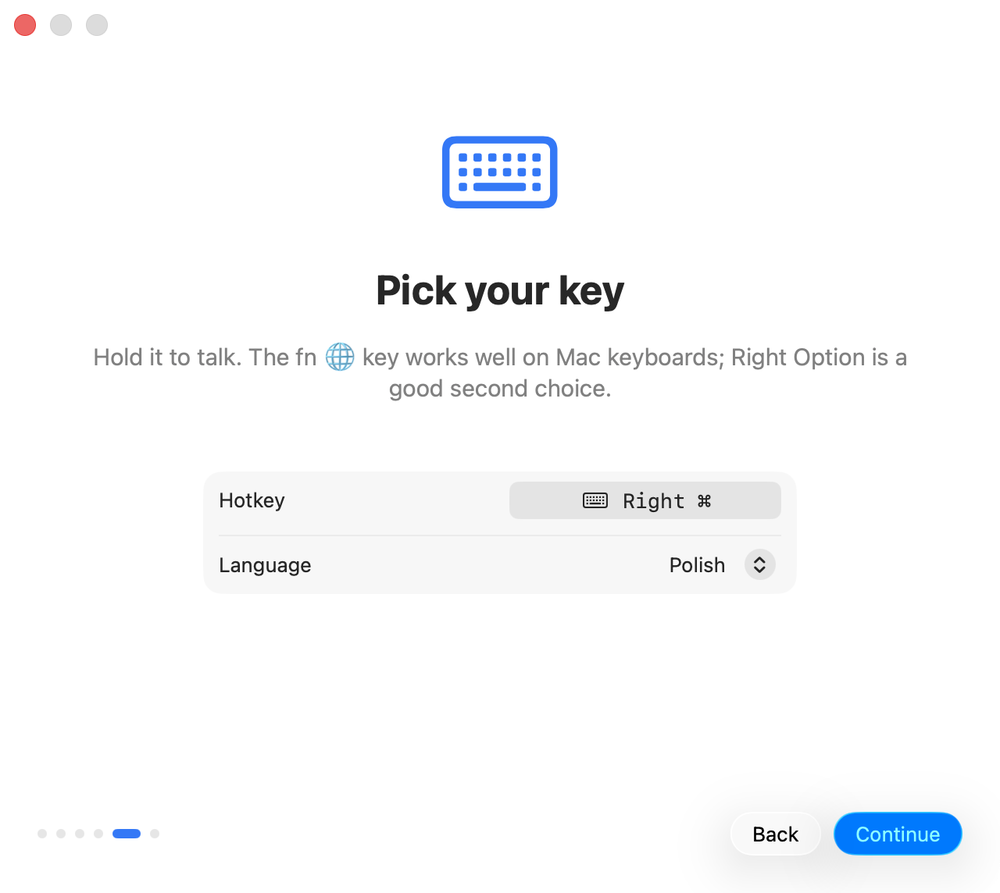
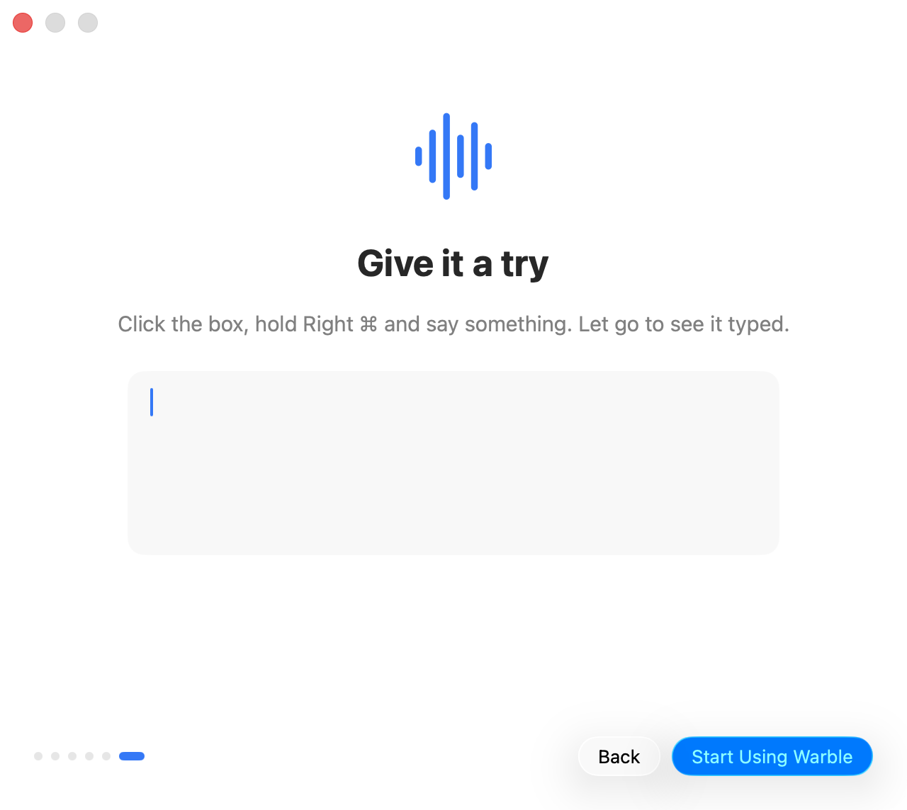

<p align="center">
  
</p>

<h1 align="center">Warble</h1>

<p align="center">
  <strong>Free, local voice dictation for macOS.</strong><br>
  Hold a key, speak, let go. Your words appear wherever you type.<br>
  NVIDIA Parakeet runs on your Mac, so no audio or text ever leaves it.
</p>

<p align="center">
  <a href="https://warble.lucaspiera.com"><strong>Documentation</strong></a> ·
  <a href="#install">Install</a> ·
  <a href="https://warble.lucaspiera.com/docs/privacy">Privacy</a> ·
  <a href="https://github.com/pieralukasz/warble/issues">Issues</a>
</p>

<p align="center">
  
  
  
  
</p>

<p align="center">
  
</p>

## Why Warble

Most dictation apps send your voice to a server, charge a subscription, or both. Warble does neither. It records while you hold a key, transcribes with [NVIDIA Parakeet TDT v3](https://huggingface.co/nvidia/parakeet-tdt-0.6b-v3) on the Neural Engine, and pastes the text at your cursor in any app: mail, chat, editors, terminals, forms.

- **Local.** The model runs on your Mac through [FluidAudio](https://github.com/FluidInference/FluidAudio). After a one-time download of about 500 MB it works offline.
- **Free.** No account, no subscription, no word limit, no telemetry. MIT licensed.
- **Native.** SwiftUI and Liquid Glass on macOS 26, living in the menu bar.
- **Multilingual.** 25 European languages, including English and Polish, or Auto-Detect.

## A quick tour

<table>
  <tr>
    <td width="42%" valign="top">
      <picture>
        <source media="(prefers-color-scheme: dark)" srcset="docs-site/public/screenshots/menubar-dark.png">
        
      </picture>
    </td>
    <td valign="top">
      <h3>The menu bar is home</h3>
      <p>Click the icon for the status, your last dictation with a copy button, and round toggles in the style of Control Center: language, Hold or Toggle mode, the recording pill and sounds.</p>
      <p>Right-click it for Settings and Quit.</p>
    </td>
  </tr>
</table>

### The recording pill

One piece of Liquid Glass near the bottom of the screen that changes shape as you go: a wide capsule with a live waveform while you speak, small dots while Parakeet transcribes, and a check mark when the text is typed.

<p align="center">
  
  
  
</p>

### History, dictionary and settings

One window in the style of System Settings. **History** is searchable and grouped by day, with the app each dictation went into, its length and optional audio replay. The **dictionary** fixes names and jargon and expands short phrases like “my email” into full text.

<table>
  <tr>
    <td width="50%"></td>
    <td width="50%"></td>
  </tr>
  <tr>
    <td align="center"><sub>Words and replacements, added from a floating bar</sub></td>
    <td align="center"><sub>Settings that save as you go</sub></td>
  </tr>
</table>

### Setup that does the work

The first launch walks through the microphone and Accessibility permissions, downloads the model, lets you pick your key and language, and ends with a practice dictation.

<table>
  <tr>
    <td width="33%"></td>
    <td width="33%"></td>
    <td width="33%"></td>
  </tr>
</table>

## Install

Requires macOS 26 and Xcode 26 or its Command Line Tools (Swift 6.2).

```bash
git clone https://github.com/pieralukasz/warble.git
cd warble
scripts/install.sh
```

The script builds a release, installs `~/Applications/Warble.app`, links the `warble` command into `~/.local/bin` and opens the app. The setup window takes it from there.

**Using a coding agent?** Point Claude Code, Codex or similar at this repository and ask it to follow the [install steps for agents](https://warble.lucaspiera.com/docs/installation#for-agents). It can build and install everything; only the Microphone and Accessibility prompts at the end need you.

Coming from open-wispr? Warble imports `~/.config/open-wispr/config.json` on first launch. Quit the old app first, since both listen to the same key.

Uninstall with `scripts/uninstall.sh`, or `scripts/uninstall.sh --purge` to also delete settings, history and dictionary.

## Command line

```text
warble status                     Show hotkey, language, audio input and autostart
warble set-hotkey <key>           globe, rightoption, f5, ctrl+space, ...
warble set-language <code>        pl, en, auto, ...
warble transcribe-file <path>     Transcribe an audio file and print the text
warble enable-autostart           Start at login
```

## Documentation

The full guide is at **[warble.lucaspiera.com](https://warble.lucaspiera.com)**: dictating, the dictionary, settings, languages, the CLI, the config file, privacy and troubleshooting. Its source lives in [`docs-site`](docs-site), built with [Fumadocs](https://fumadocs.dev):

```bash
cd docs-site && bun install && bun run dev
```

## Development

```bash
swift test --disable-sandbox
WARBLE_PREVIEW=history .build/Warble.app/Contents/MacOS/warble start   # any screen on sample data
scripts/capture-screenshots.sh                                         # refresh every screenshot
```

See [CONTRIBUTING.md](CONTRIBUTING.md) and the [architecture page](https://warble.lucaspiera.com/docs/architecture).

## Credits

Warble grew out of [open-wispr](https://github.com/human37/open-wispr) by human37 (MIT). Speech recognition is NVIDIA Parakeet TDT v3 via [FluidAudio](https://github.com/FluidInference/FluidAudio) (Apache 2.0).

## License

MIT. See [LICENSE](LICENSE).
